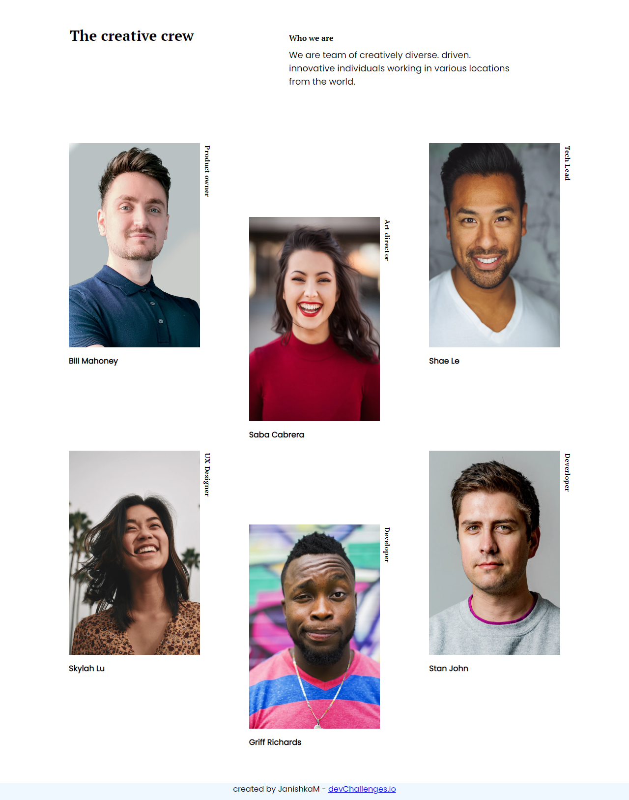

# My Team (DevChallenges)



A responsive web project showcasing a team page, designed for the DevChallenges platform. The site features a clean layout, modern design, and highlights team members with photos and roles.

---

## Key Features

- Responsive design for desktop and mobile
- Team member profiles with photos and roles
- Clean, modern UI
- Accessible and semantic HTML
- Easy to customize

---

## Technologies Used

- HTML5
- CSS3

---

## Getting Started

1. **Clone the repository:**
  ```bash
  git clone https://github.com/JanishkaM/My-Team-devchallenges.git
  ```
2. **Open the project folder:**
  ```bash
  cd My-Team-devchallenges
  ```
3. **Launch the site:**
  - Open `index.html` in your web browser.

---

## Folder Structure

```
My-Team-devchallenges/
│
├── index.html
├── README.md
├── css/
│   └── style.css
├── img/
│   ├── devchallenges.png
│   ├── photo1.png
│   ├── photo2.png
│   ├── photo3.png
│   ├── photo4.png
│   ├── photo5.png
│   ├── photo6.png
│   └── screanshot.png
```

---

## Credits

- Inspired by [DevChallenges.io](https://devchallenges.io/)
- Images and assets from DevChallenges resources

---

## License

This project is licensed under the MIT License. 